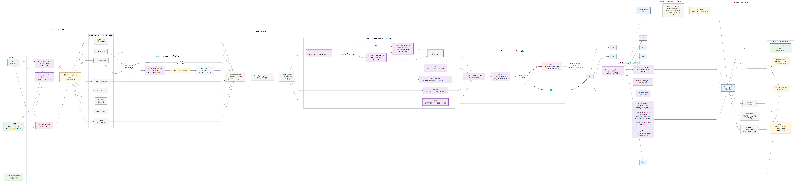

# jobHunter 流水线架构

下面这张流程图描绘了 v0.2.0 一次 run 的完整端到端路径 —— 从用户在 CLI 输入「公司 + 岗位 + 城市」到浏览器打开单文件 HTML 报告。



源文件：[pipeline.mmd](pipeline.mmd)（Mermaid 语法，可直接在 GitHub / VS Code / Mermaid Live Editor 里渲染）。

## 11 个阶段概览

| # | 阶段 | 角色 | 关键模块 |
|---|---|---|---|
| 1 | CLI 入口 | 客户端 | `cli.py`（InquirerPy 交互 / Click 非交互 / `watch` 子命令） |
| 2 | Query 准备 | 处理 | `list_company_aliases` + `list_workplace_slang`（LLM 生成别名 + slang，失败 fallback 主名） |
| 3 | Round 1 采集 | 8 路并发 collector | gsxt / Tavily（business / judicial / company_info / reviews / news）/ wenshu / sogou_weixin |
| 4 | Round 2 实体别名（条件触发） | LLM 抽 3-5 个内部实体 → 同名 collectors 再跑一次 | `list_company_entities` · 硬上限 1 轮 / 5 实体 |
| 5 | Normalize | 服务 | bucket by domain + `REVIEW_URL_PATTERNS` 过滤 + URL 去重 |
| 6 | Extract per domain（LLM 并发） | 5 路 + reviews 3 阶段 | business / judicial / company_info / news / reviews（含 `_needs_second_pass` + `_loose_keyword_reviews` 兜底） |
| 7 | Consolidate | 1 个 LLM aggregate 调用 | max_tokens=8000，失败 fallback 到原始 facets |
| 8 | Compute（deterministic 并发） | 4 个独立 + 1 个合并盒（H_MISC 含 7 个） | 5 轴 / 顶层 verdict / 面试反问 / 薪酬 band + 7 个并行（冲突检测 / 置信度 / collector notes / snapshot diff / 编辑手记 / 信号 tier / 试用期清单） |
| 9 | 同行业对比（仅 `--compare`） | 轻量级 peer runner | `run_peer_comparison` 用 `Semaphore(2)` 限流，跳过别名 / slang / round 2 / consolidate |
| 10 | Build Report | Jinja2 渲染 | `report.html.j2`（7 编号章节 + 4 侧栏 + 风险提示 + Σ 来源附录） |
| 11 | 输出 + 持久化 | 存储 | `reports/*.html` + `snapshot.json` + `watchlist.json` + open / print |

## 视觉规范

| 颜色 | 含义 | 示例 |
|---|---|---|
| 🟢 绿色 | 客户端 / 用户交互 | CLI 入口、open_browser |
| 🔵 蓝色 | 网关 / 编排器 | build_report 渲染入口 |
| ⚪ 灰色 | 核心服务（无状态） | normalize / collectors / extract per domain |
| 🟣 紫色 | 处理 / LLM 调用 | list_* LLM 调用、consolidate、interview questions |
| 💜 浅紫 | deterministic 计算 | compute_axes / verdict / band / stories |
| 🟡 黄色 | 存储 / 持久化 | CompanyQuery / reports/ / snapshot / watchlist |
| 🔴 红色 | 失败 / fallback 路径 | consolidate 失败 → facets fallback |
| ⚪️ 白底 | 决策点 | reviews 厚度判断 / consolidate 成功与否 |

## 关键不变量

1. **LLM 抽取失败时永远不阻塞 run** — reviews 章有 `_loose_keyword_reviews` 关键词兜底；consolidate 失败 fallback 到原始 facets。
2. **所有 compute 阶段是 deterministic** — 不走 LLM，零网络调用，确定性结果（`compute_*` / `diff_*` / `extract_collector_notes`）。
3. **24h FileCache 让重复 0 成本** — Tavily cache + snapshot diff 让 watchlist + 同行业对比天然廉价。
4. **软失败是默认行为** — `safe_collect()` 包超时 + 异常；gsxt / wenshu 在非 CN IP 软失败时 collector_notes 上墙提示手动核查。

## 重画 / 修改

```bash
# 重新渲染（如改 Mermaid 源码）
bash ~/.claude/skills/evhz-skills/draw-technical-diagrams/scripts/render-mermaid.sh \
  docs/diagrams/pipeline.mmd \
  docs/diagrams/pipeline.png \
  2000 4

# 也可输出 SVG（矢量，方便嵌入 Markdown / 演示文稿）
bash ~/.claude/skills/evhz-skills/draw-technical-diagrams/scripts/render-mermaid.sh \
  docs/diagrams/pipeline.mmd \
  docs/diagrams/pipeline.svg \
  2000 4
```